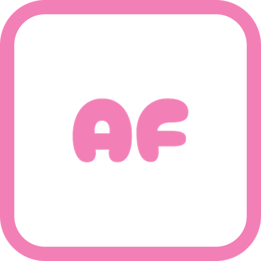

# Auto Frontline

[日本語](README.ja.md)

<p align="center">
  
</p>

Auto Frontline is a Dalamud plugin that automates Frontline movement and combat with vnavmesh and Rotation Solver Reborn.

In **Loop** it queues Daily Frontline, enters, fights, and leaves up to a max count. In **Manual** you join from Contents Finder; auto-enter and auto-leave still apply when enabled. Follow prefers combat mode, then commander, then group movement.

Experimental commander follow, combat mode, and auto limit break can change or be removed without notice.

## Install

1. Run `/xlsettings` and open the **Experimental** tab
2. Add this URL under **Custom Plugin Repositories**:

```
https://raw.githubusercontent.com/exatrines/DalamudPlugins/refs/heads/main/pluginmaster.json
```

3. Run `/xlplugins` and install **Auto Frontline**

## Features

- **Loop / Manual** — queue Daily Frontline automatically, or join from Contents Finder
- **Group movement** — follow clustered allies; skip stationary and repeatedly picked targets
- **Spawn exit** — leave the spawn exclusion zone; some fields use a fixed exit
- **Stuck recovery** — use Return when group movement stalls
- **Mount** — mount outside enemy range, dismount when hostiles are close
- **Experimental: commander follow** — follow the latest alliance chat speaker
- **Experimental: combat mode** — move with allies near the closest enemy
- **Experimental: auto limit break** — `/pvpaction` in combat mode, per job
- **UI language** — follow the client, or lock English / Japanese

Required plugins: [vnavmesh](https://github.com/awgil/ffxiv_navmesh), [Rotation Solver Reborn](https://github.com/FFXIV-CombatReborn/RotationSolverReborn).

## Commands

| Command | Description |
| --- | --- |
| `/autofrontline` | Toggle settings window |
| `/autofrontline on` | Set Manual mode |
| `/autofrontline off` | Set Disable mode |
| `/autofrontline toggle` | Toggle Manual / Disable (stops Loop if running) |

## For developers

1. `git submodule update --init --recursive`
2. Build: `dotnet build AutoFrontline.sln -c Release -p:Platform=x64`
3. Point Dalamud’s **dev plugin** path at `AutoFrontline/bin/Release/`
4. Enable **Auto Frontline** in the plugin installer (dev)

[MirageUI](https://github.com/exatrines/MirageUI) is included as a git submodule for the shared UI kit. [ECommons](https://github.com/NightmareXIV/ECommons) is also a submodule.

## License

[AGPL-3.0-or-later](https://www.gnu.org/licenses/agpl-3.0.html)
